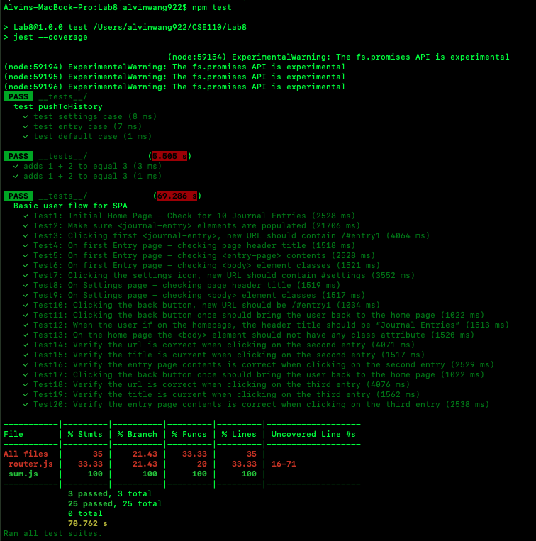

# Lab8_Starter

## Check your understanding q's (FILL OUT)
1. In your own words: Where would you fit your automated tests in your Bujo project development pipeline? (just write the letter)

Answer: A (or 1?) Within a Github action that runs whenever code is pushed 

2. Would you use a unit test to test the “message” feature of a messaging application? Why or why not? For this question, assume the “message” feature allows a user to write and send a message to another user.
   
Answer: No, the "message" feature seems to include multiple components of the application as it allows a user to write and send a message to another user. However, unit testing should be used on just one component of the application, not multiple.

3. Would you use a unit test to test the “max message length” feature of a messaging application? Why or why not? For this question, assume the “max message length” feature prevents the user from typing more than 80 characters

Answer: Yes, the “max message length” feature of a messaging application just prevents the user from typing more than 80 characters, which is small enough to be a single component. Thus, I would use a unit test to test it.

4. What do you expect to happen if we run our puppeteer tests with the field “headless” set to true?
   
Answer: If we run our puppeteer tests with the field “headless” set to true, the tests will run without a browser UI.

5. What would your beforeAll callback look like if you wanted to start from the settings page before every test case?

Answer: Since updating the url directly does not work, we would have to actually click the settings image to navigate and start from the settings page before every test case. This can be done using `await page.click('header > img')`, assuming you start from the home page.

Screenshot:

